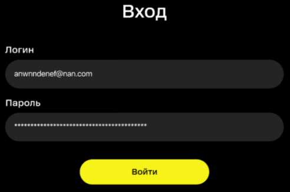
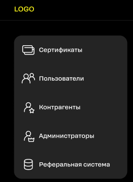
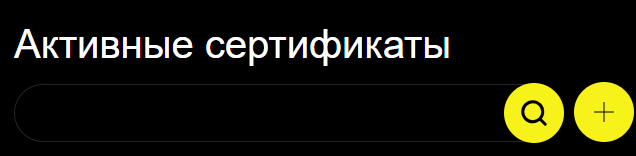
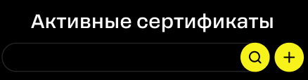
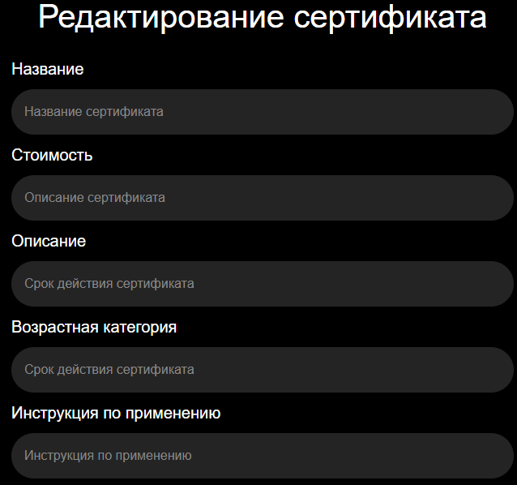
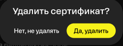
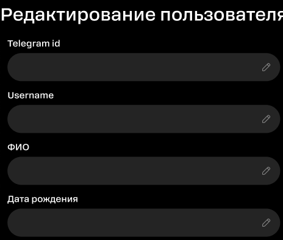
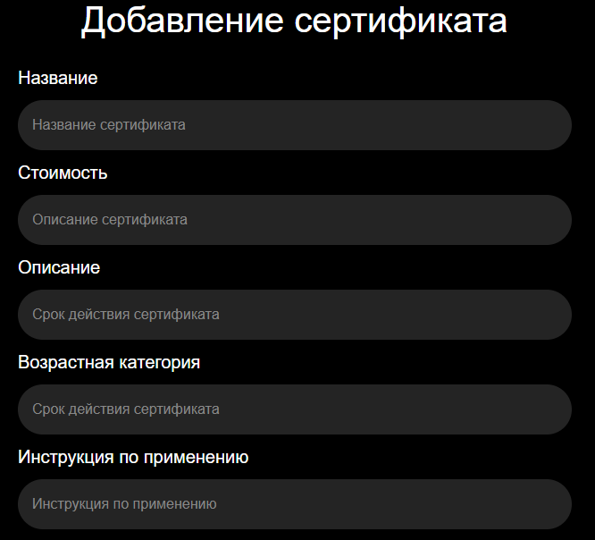

# Баг-репорты
##### Баг-репорт №1

| Заголовок | На странице входа кнопка «Войти» имеет не тот размер и надпись |
| ------ | ------ |
| Описание | На странице входа кнопка «Сохранить изменения» должна называться «Войти» и быть меньше по ширине |
| Шаги воспроизведения |  1. Перейти по ссылке [http://ujvm-ot9.turtlesource.tech/] |
| Текущий результат |  |
| Ожидаемый результат |  |
| Тестовое окружение | Google Chrome version 129.0.6668.101   Mozilla Firefox version 131.0.3   Yandex version 24.7.6.974   Safari 18 |
| Критичность | Незначительный |

##### Баг-репорт №2

| Заголовок | На странице входа отсутствует хедер сайта  |
| ------ | ------ |
| Описание | На странице входа отсутствует хедер сайта с LOGO и иконкой шестеренки (настройки) |
| Шаги воспроизведения |  1. Перейти по ссылке [http://ujvm-ot9.turtlesource.tech/] |
| Текущий результат |  |
| Ожидаемый результат |  |
| Тестовое окружение | Google Chrome version 129.0.6668.101   Mozilla Firefox version 131.0.3   Yandex version 24.7.6.974   Safari 18  |
| Критичность | Незначительный |

##### Баг-репорт №3

| Заголовок |В хедере надпись LOGO не того размера на всех страницах  |
| ------ | ------ |
| Описание | В хедере надпись LOGO не того размера, что в макете. В макете надпись по размеру меньше |
| Шаги воспроизведения |  1. Перейти по ссылке [http://ujvm-ot9.turtlesource.tech/]   2. Нажать кнопку «Сохранить изменения»|
| Текущий результат |  |
| Ожидаемый результат |  |
| Тестовое окружение | Google Chrome version 129.0.6668.101   Mozilla Firefox version 131.0.3   Yandex version 24.7.6.974   Safari 18  |
| Критичность | Тривиальный |

##### Баг-репорт №4

| Заголовок | На странице главного меню заголовок «Активные сертификаты» выровнен не по центру  |
| ------ | ------ |
| Описание | На странице главного меню заголовок «Активные сертификаты» выровнен не по центру, а по левому краю |
| Шаги воспроизведения |  1. Перейти по ссылке [http://ujvm-ot9.turtlesource.tech/]   2. Нажать кнопку «Сохранить изменения»|
| Текущий результат |  |
| Ожидаемый результат |  |
| Тестовое окружение | Google Chrome version 129.0.6668.101   Mozilla Firefox version 131.0.3   Yandex version 24.7.6.974   Safari 18  |
| Критичность | Тривиальный |

##### Баг-репорт №5

| Заголовок | На странице главного меню иконка добавления сертификата отличается от иконки в макете  |
| ------ | ------ |
| Описание | На странице главного меню иконка добавления сертификата отличается от иконки в макете |
| Шаги воспроизведения |  1. Перейти по ссылке [http://ujvm-ot9.turtlesource.tech/]   2. Нажать кнопку «Сохранить изменения»|
| Текущий результат |  |
| Ожидаемый результат |  |
| Тестовое окружение | Google Chrome version 129.0.6668.101   Mozilla Firefox version 131.0.3   Yandex version 24.7.6.974   Safari 18  |
| Критичность | Тривиальный |

##### Баг-репорт №6

| Заголовок | На странице редактирования сертификата плейсхолдеры не соответствуют полям ввода   |
| ------ | ------ |
| Описание | На странице редактирования сертификата у трех полей ввода неправильные плейсхолдеры: стоимость, описание и возрастная категория |
| Шаги воспроизведения |  1. Перейти по ссылке [http://ujvm-ot9.turtlesource.tech/]   2. Нажать кнопку «Сохранить изменения»   3. Нажать на иконку «карандаш» на сертификате|
| Текущий результат |  |
| Ожидаемый результат | Каждому полю ввода соответствует свой плейсхолдер: Стоимость-Стоимость сертификата   Описание-Описание сертификата   Возрастная категория-Возрастная категория сертификата|
| Тестовое окружение | Google Chrome version 129.0.6668.101   Mozilla Firefox version 131.0.3   Yandex version 24.7.6.974   Safari 18 |
| Критичность | Тривиальный |

##### Баг-репорт №8

| Заголовок | На странице редактирования сертификата кнопка «Сохранить изменения» не соответствует размеру |
| ------ | ------ |
| Описание | кнопка «Сохранить изменения» шире, чем в макете |
| Шаги воспроизведения |  1. Перейти по ссылке [http://ujvm-ot9.turtlesource.tech/]   2. Нажать кнопку «Сохранить изменения»   3. Нажать на иконку «карандаш» на сертификате|
| Текущий результат |  |
| Ожидаемый результат |  |
| Тестовое окружение | Google Chrome version 129.0.6668.101   Mozilla Firefox version 131.0.3   Yandex version 24.7.6.974   Safari 18 |
| Критичность | Тривиальный |

##### Баг-репорт №9

| Заголовок | В модальном окне удаления сертификата кнопка «Нет, не удалять» имеет лишний желтый фон |
| ------ | ------ |
| Описание | В модальном окне удаления сертификата кнопка «Нет, не удалять» имеет лишний желтый фон, текст сливается с фоном и не читается |
| Шаги воспроизведения |  1. Перейти по ссылке [http://ujvm-ot9.turtlesource.tech/]   2. Нажать кнопку «Сохранить изменения»   3. Нажать на красный крестик на сертификате|
| Текущий результат |  |
| Ожидаемый результат |  |
| Тестовое окружение | Google Chrome version 129.0.6668.101   Mozilla Firefox version 131.0.3   Yandex version 24.7.6.974   Safari 18 |
| Критичность | Значительный |

##### Баг-репорт №10

| Заголовок | На странице редактирования пользователя поле ввода Telegram ID не кликабельно  |
| ------ | ------ |
| Описание | В поле ввода Telegram ID не возможно ввести значение |
| Шаги воспроизведения |  1. Перейти по ссылке [http://ujvm-ot9.turtlesource.tech/]   2. Нажать кнопку «Сохранить изменения»   3. Нажать на «Пользователи» на боковой панели   4. Нажать на иконку карандаша напротив почты пользователя |
| Текущий результат |  |
| Ожидаемый результат |  |
| Тестовое окружение | Google Chrome version 129.0.6668.101   Mozilla Firefox version 131.0.3   Yandex version 24.7.6.974   Safari 18 |
| Критичность | Значительный |

##### Баг-репорт №11

| Заголовок | На странице добавления сертификата плейсхолдеры не соответствуют полям ввода  |
| ------ | ------ |
| Описание | На странице добавления сертификата у трех полей ввода неправильные плейсхолдеры: стоимость, описание и возрастная категория  |
| Шаги воспроизведения |  1. Перейти по ссылке [http://ujvm-ot9.turtlesource.tech/]   2. Нажать кнопку «Сохранить изменения»   3. Нажать на кнопку добавления сертификата |
| Текущий результат |  |
| Ожидаемый результат | Каждому полю ввода соответствует свой плейсхолдер: Стоимость-Стоимость сертификата   Описание-Описание сертификата   Возрастная категория-Возрастная категория сертификата |
| Тестовое окружение | Google Chrome version 129.0.6668.101   Mozilla Firefox version 131.0.3   Yandex version 24.7.6.974   Safari 18 |
| Критичность | Значительный |

##### Баг-репорт №12

| Заголовок | На странице добавления сертификата кнопка «Добавить» не той ширины  |
| ------ | ------ |
| Описание | На странице добавления сертификата кнопка «Добавить» шире, чем в макете  |
| Шаги воспроизведения |  1. Перейти по ссылке [http://ujvm-ot9.turtlesource.tech/]   2. Нажать кнопку «Сохранить изменения»   3. Нажать на кнопку добавления сертификата |
| Текущий результат |  |
| Ожидаемый результат |  |
| Тестовое окружение | Google Chrome version 129.0.6668.101   Mozilla Firefox version 131.0.3   Yandex version 24.7.6.974   Safari 18 |
| Критичность | Тривиальный |

##### Баг-репорт №13

| Заголовок | На странице реферальной системы в поле Вознаграждение отсутствует обозначение валюты рубля  |
| ------ | ------ |
| Описание | В поле Вознаграждение отсутствует обозначение валюты рубля  |
| Шаги воспроизведения |  1. Перейти по ссылке [http://ujvm-ot9.turtlesource.tech/]   2. Нажать кнопку «Сохранить изменения»   3. Нажать на «Реферальная система» на боковой панели |
| Текущий результат |  |
| Ожидаемый результат |  |
| Тестовое окружение | Google Chrome version 129.0.6668.101   Mozilla Firefox version 131.0.3   Yandex version 24.7.6.974   Safari 18 |
| Критичность | Тривиальный |

##### Баг-репорт №14

| Заголовок | На странице редактирования пользователя в полях ввода некликабельная иконка редактирования  |
| ------ | ------ |
| Описание | При нажатии на иконку редактирования  ничего не происходит  |
| Шаги воспроизведения |  1. Перейти по ссылке [http://ujvm-ot9.turtlesource.tech/]   2. Нажать кнопку «Сохранить изменения»   3. Нажать на «Пользователи» на боковой панели   4. Нажать на иконку карандаша напротив почты пользователя |
| Текущий результат | При нажатии на иконку редктирования ничего не происходит |
| Ожидаемый результат | При нажатии на иконку редктирования данные в полях ввода редактируются и сохраняются |
| Тестовое окружение | Google Chrome version 129.0.6668.101   Mozilla Firefox version 131.0.3   Yandex version 24.7.6.974   Safari 18 |
| Критичность | Значительный |

##### Баг-репорт №15

| Заголовок | На странице ввода промокода кнопка «Активировать» не того размера  |
| ------ | ------ |
| Описание | Кнопка «Активировать» по размеру шире, чем в макете  |
| Шаги воспроизведения |  1. Перейти по ссылке [http://ujvm-ot9.turtlesource.tech/]   2. Нажать кнопку «Сохранить изменения»   3. Нажать на кнопку добавления промокода |
| Текущий результат |  |
| Ожидаемый результат |  |
| Тестовое окружение | Google Chrome version 129.0.6668.101   Mozilla Firefox version 131.0.3   Yandex version 24.7.6.974   Safari 18 |
| Критичность | Значительный |

##### Баг-репорт №16

| Заголовок | На странице главного меню в хедере значок настроек не кликабельный  |
| ------ | ------ |
| Описание | На странице главного меню в хедере значок настроек  не кликабельный  |
| Шаги воспроизведения |  1. Перейти по ссылке [http://ujvm-ot9.turtlesource.tech/]   2. Нажать кнопку «Сохранить изменения» |
| Текущий результат | При нажатии на иконку настроек, иконка не реагирует  |
| Ожидаемый результат | Иконка настроек кликабельна |
| Тестовое окружение | Google Chrome version 129.0.6668.101   Mozilla Firefox version 131.0.3   Yandex version 24.7.6.974   Safari 18 |
| Критичность | Значительный |
