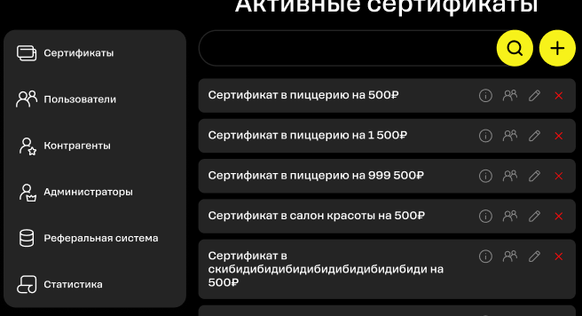
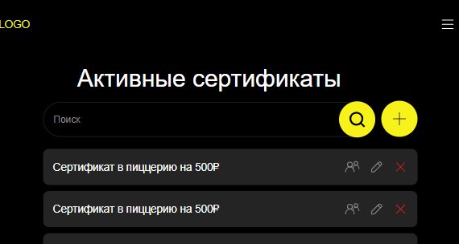

# Тестирование адаптивности сайта
## Кроссбраузерное тестирование Desktop
## Баг-репорты
##### Баг-репорт №1

| Заголовок | При ширине экрана от 1800 до 1888 боковая панель слипается с другими элементами|
| ------ | ------ |
| Описание | При ширине экрана от 1800 до 1888 боковая панель слипается с другими элементами |
| Шаги воспроизведения |  1. Перейти по ссылке [http://ujvm-ot9.turtlesource.tech/]   2. Нажать на кнопку "Войти" |
| Текущий результат |  |
| Ожидаемый результат | Элементы не налипают друг на друга|
| Тестовое окружение | Google Chrome version 130.0, Yandex 24, Safari 18, Firefox 131 |
| Разрешение | width 1800 to 1888 |
| Критичность | Незначительный |

##### Баг-репорт №2

| Заголовок | На странице редактирования сертификата в поле ввода "Описание" текст не переносится на новую строку |
| ------ | ------ |
| Описание | На странице редактирования сертификата в поле ввода "Описание" предполагается, что длинный текст не растягивается в одну линию |
| Шаги воспроизведения |  1. Перейти по ссылке [http://ujvm-ot9.turtlesource.tech/]   2. Нажать на кнопку "Войти"   3. Нажать на боковой панели "Сертификаты"   4. На сертификате нажать на иконку карандаша |
| Текущий результат |  |
| Ожидаемый результат |  |
| Тестовое окружение | Google Chrome version 130.0, Safari 18, Yandex 24, Firefox 131 |
| Разрешение | 1920x1080, 1366x768, 1440x900, 2560x1440, 1280x1024 |
| Критичность | Значительный |

##### Баг-репорт №3

| Заголовок |При удалении сертификата в модальном окне дублируется вопрос об удалении |
| ------ | ------ |
| Описание | При удалении сертификата в модальном окне дублируется вопрос об удалении |
| Шаги воспроизведения |  1. Перейти по ссылке [http://ujvm-ot9.turtlesource.tech/]   2. Нажать на кнопку "Войти"   3. Нажать на боковой панели "Сертификаты"   4. На сертификате нажать на красный крестик |
| Текущий результат |  |
| Ожидаемый результат |  |
| Тестовое окружение | Google Chrome version 130.0, Safari 18, Firefox 131 |
| Разрешение | 1920x1080, 1366x768, 1440x900, 2560x1440, 1280x1024 |
| Критичность | Значительный |

##### Баг-репорт №4

| Заголовок | В модальном окне ввода купона обрезаются цифры  |
| ------ | ------ |
| Описание | В модальном окне ввода купона обрезаются цифры |
| Шаги воспроизведения |  1. Перейти по ссылке [http://ujvm-ot9.turtlesource.tech/]   2. Нажать на кнопку "Войти"   3. Нажать на иконку купона внизу страницы|
| Текущий результат |  |
| Ожидаемый результат | Цифры не обрезаются  |
| Тестовое окружение | Google Chrome version 130.0, Safari 18, Yandex 24, Firefox 131  |
| Разрешение | 1920x1080, 1366x768, 1440x900, 2560x1440, 1280x1024 |
| Критичность | Значительный |

##### Баг-репорт №5

| Заголовок | На странице статистики выпадающий список с месяцами после нажатия приобретает прямоугольную форму |
| ------ | ------ |
| Описание | На странице статистики выпадающий список с месяцами после нажатия приобретает прямоугольную форму |
| Шаги воспроизведения |  1. Перейти по ссылке [http://ujvm-ot9.turtlesource.tech/]   2. Нажать на кнопку "Войти"   3. На боковой панели нажать на "Статистика"   4. Нажать на выпадающий список "За всё время"|
| Текущий результат |  |
| Ожидаемый результат |   |
| Тестовое окружение | Google Chrome version 130.0, Safari 18, Yandex 24, Firefox 131  |
| Разрешение | 1920x1080, 1366x768, 1440x900, 2560x1440, 1280x1024 |
| Критичность | Значительный |

##### Баг-репорт №6

| Заголовок | Модальное окно удаления сертификата растягивается на всю ширину экрана  |
| ------ | ------ |
| Описание | Модальное окно удаления сертификата растягивается на всю ширину экрана  |
| Шаги воспроизведения |  1. Перейти по ссылке [http://ujvm-ot9.turtlesource.tech/]   2. Нажать на кнопку "Войти"   3. Нажать на боковой панели "Сертификаты"   4. На сертификате нажать на красный крестик |
| Текущий результат |  |
| Ожидаемый результат |  |
| Тестовое окружение | Google Chrome version 130.0   |
| Разрешение | 1366x768, 1440x900, 1280x1024 |
| Критичность | Незначительный |

##### Баг-репорт №7

| Заголовок | На странице статистики надпись "Статистика" имеет очень маленький размер |
| ------ | ------ |
| Описание | На странице статистики надпись "Статистика" имеет очень маленький размер и расположена влотную к блоку с выпадающим окном "За всё время" |
| Шаги воспроизведения |  1. Перейти по ссылке [http://ujvm-ot9.turtlesource.tech/]   2. Нажать на кнопку "Войти"   3. На боковой панели нажать на "Статистика" |
| Текущий результат |  |
| Ожидаемый результат |  |
| Тестовое окружение | Google Chrome version 130.0, Safari 18, Yandex 24, Firefox 131 |
| Разрешение | 1366x768, 1440x900, 1280x1024 |
| Критичность | Тривиальный |

##### Баг-репорт №8

| Заголовок | На странице главного меню боковая панель находится очень далеко от списка сертификатов |
| ------ | ------ |
| Описание |  Боковая панель находится очень далеко от списка сертификатов |
| Шаги воспроизведения |  1. Перейти по ссылке [http://ujvm-ot9.turtlesource.tech/]   2. Нажать на кнопку "Войти" |
| Текущий результат |  |
| Ожидаемый результат |  |
| Тестовое окружение | Google Chrome version 130.0, Yandex 24, Firefox 131 |
| Разрешение | 2560x1440 |
| Критичность | Тривиальный |

##### Баг-репорт №9

| Заголовок | На странице добавления сертификата заголовок страницы вплотную прилегает к полю "Название" |
| ------ | ------ |
| Описание | Заголовок расположен слишком близко к слову "Название" |
| Шаги воспроизведения |  1. Перейти по ссылке [http://ujvm-ot9.turtlesource.tech/]   2. Нажать на кнопку "Войти"   3. Нажать на иконку добавления нового сертификата |
| Текущий результат |  |
| Ожидаемый результат |  |
| Тестовое окружение | Google Chrome version 130.0, Safari 18, Yandex 24, Firefox 131 |
| Разрешение | 2560x1440 |
| Критичность | Тривиальный |

##### Баг-репорт №10

| Заголовок | На странице добавления сертификата заголовок страницы очень маленького размера |
| ------ | ------ |
| Описание | Заголовок имеет маленький размер, незаметен |
| Шаги воспроизведения |  1. Перейти по ссылке [http://ujvm-ot9.turtlesource.tech/]   2. Нажать на кнопку "Войти"   3. Нажать на иконку добавления нового сертификата |
| Текущий результат |  |
| Ожидаемый результат |  |
| Тестовое окружение | Google Chrome version 130.0, Safari 18, Yandex 24, Firefox 131 |
| Разрешение | 1280x1024 |
| Критичность | Тривиальный |

##### Баг-репорт №11

| Заголовок | На странице редактирования пользователя боковая панель и поля ввода расположены очень близко друг к другу |
| ------ | ------ |
| Описание | Между элементами очень мало пространства |
| Шаги воспроизведения |  1. Перейти по ссылке [http://ujvm-ot9.turtlesource.tech/]   2. Нажать на кнопку "Войти"   3. На боковой панели нажать на "Пользователи"   4. Нажать на иконку редактирования пользователя |
| Текущий результат |  |
| Ожидаемый результат | Элементы расположены чуть дальше друг от друга |
| Тестовое окружение | Google Chrome version 130.0,Safari 18, Yandex 24, Firefox 131 |
| Разрешение | 1280x1024 |
| Критичность | Тривиальный |

##### Баг-репорт №12

| Заголовок | Модальное окно удаления сертификата растягивается на всю ширину экрана |
| ------ | ------ |
| Описание | Модальное окно удаления сертификата растягивается на всю ширину экрана |
| Шаги воспроизведения |  1. Перейти по ссылке [http://ujvm-ot9.turtlesource.tech/]   2. Нажать на кнопку "Войти"   3. Нажать на боковой панели "Сертификаты"   4. На сертификате нажать на красный крестик |
| Текущий результат |  |
| Ожидаемый результат |  |
| Тестовое окружение | Safari 18 |
| Разрешение | 2560x1440 |
| Критичность | Тривиальный |

#### Кроссбраузерное тестирование Mobile

##### Баг-репорт №12

| Заголовок | На странице главного меню лого съехало к левому краю |
| ------ | ------ |
| Описание | На странице главного меню лого съехало к левому краю |
| Шаги воспроизведения |  1. Перейти по ссылке [http://ujvm-ot9.turtlesource.tech/]   2. Нажать на кнопку "Войти"   |
| Текущий результат |  |
| Ожидаемый результат | Лого выровнено по блоку сертификатов  |
| Тестовое окружение | iPad Mini, iPad Air, iPad  |
| Разрешение | 768x1024, 1024x768, 800x1280 |
| Критичность | Тривиальный |

##### Баг-репорт №13

| Заголовок | Модальное окно удаления сертификата растягивается на всю ширину экрана  |
| ------ | ------ |
| Описание | Модальное окно удаления сертификата растягивается на всю ширину экрана  |
| Шаги воспроизведения |  1. Перейти по ссылке [http://ujvm-ot9.turtlesource.tech/]   2. Нажать на кнопку "Войти"   3. Нажать на боковой панели "Сертификаты"   4. На сертификате нажать на красный крестик |
| Текущий результат |  |
| Ожидаемый результат |  |
| Тестовое окружение | iPad Mini, iPad Air, iPad Pro |
| Разрешение | 768x1024, 1024x768, 800x1280 |
| Критичность | Тривиальный |

##### Баг-репорт №14

| Заголовок | Надпись "Активные сертификаты" выровнена не по центру  |
| ------ | ------ |
| Описание | Надпись "Активные сертификаты" выровнена не по центру  |
| Шаги воспроизведения |  1. Перейти по ссылке [http://ujvm-ot9.turtlesource.tech/]   2. Нажать на кнопку "Войти" |
| Текущий результат |  |
| Ожидаемый результат | Надпись выровнена по центру |
| Тестовое окружение | iPhone 6,7,8, Samsung Galaxy A51/71 |
| Разрешение | 375x667, 412x914|
| Критичность | Тривиальный |

##### Баг-репорт №15

| Заголовок | При альбомной ориентации не видно основной информации страницы |
| ------ | ------ |
| Описание | При альбомной ориентации не видно основной информации страницы  |
| Шаги воспроизведения |  1. Перейти по ссылке [http://ujvm-ot9.turtlesource.tech/]   2. Нажать на кнопку "Войти" |
| Текущий результат |  |
| Ожидаемый результат | Основная информация страницы хорошо видна и читаема |
| Тестовое окружение | iPhone 6,7,8,13, Samsung Galaxy A51/71 |
| Разрешение | 763x414, 914x412|
| Критичность | Тривиальный |
